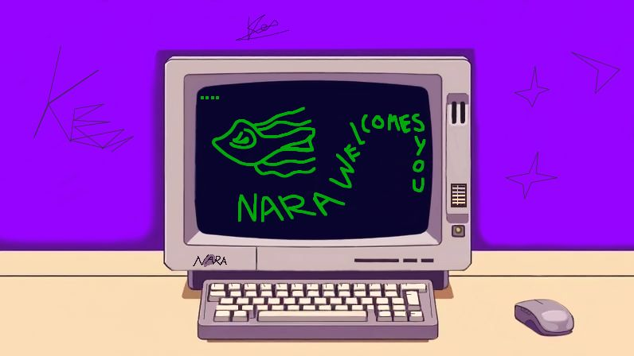

# Welcome to Spaceship Nara

## I am too kind

Hey, I'm Ken, a creator and innovator who loves experimenting with art, code, and anything that sparks creativity. I like to dive into projects that push the limits of imagination, while always staying true to my personal style.

## A way to get my things

- **a fine color**

  

**Progress:**  
`[⠀⠀⠀⠀⠀⠀⠀⠀⠀⠀⠀⠀⠀⠀⠀⠀⠀⠀⠀⠀⠀⠀⠀⠀⠀⠀⠀⠀]` 0%  

---

- **are using me**

  

**Progress:**  
`[⠀⠀⠀⠀⠀⠀⠀⠀⠀⠀⠀⠀⠀⠀⠀⠀⠀⠀⠀⠀⠀⠀⠀⠀⠀⠀⠀⠀]` 0%  

---

- **faster faster** 

  

**Progress:**  
`[█████████████⠀⠀⠀⠀⠀⠀⠀⠀⠀⠀⠀⠀⠀⠀⠀⠀⠀]` 29%  

---
